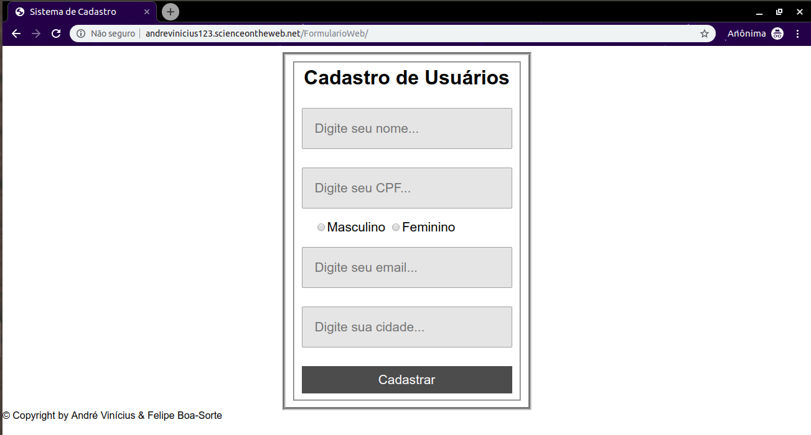
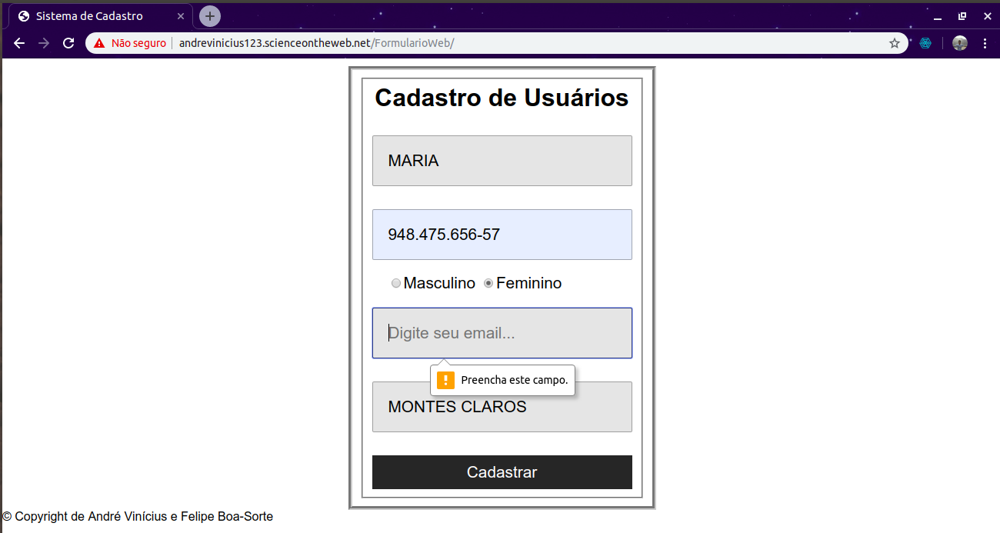
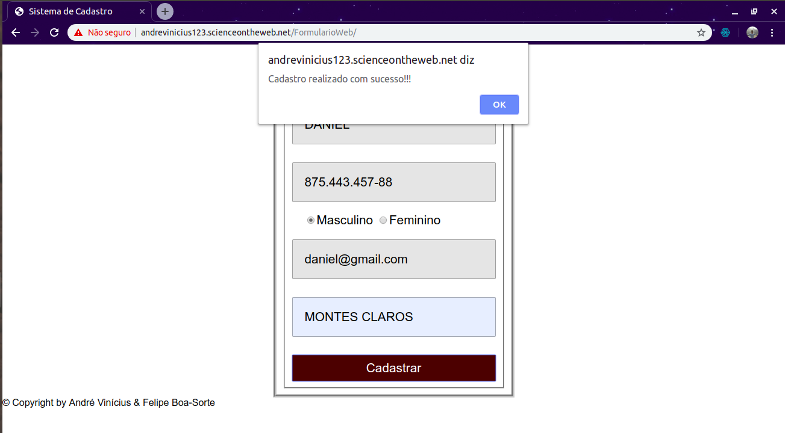

# FormularioWeb

Site: http://andrevinicius123.scienceontheweb.net/FormularioWeb/

# Tecnologias Utilizadas:
HTML, CSS e JavaScript

# Objetivo
O presente projeto tem por objetivo a conclusão do trabalho final referente a disciplina de Paradigmas de Computação. E sua finalidade é apresentar o uso da linguagem JavaScript em um Formulário Web.

# Tutorial
Ao clicar no link acima, abrirá a tela de Cadastro de usuários.

Em seguida, deve ser preenchido os campos Nome, CPF, email e cidade, e selecionado o campo sexo. Caso não seja preenchido algum campo, aparecerá uma mensagem de verificação mostrando qual campo deve ser preenchido ou selecionado.

Se todos os campos forem preenchidos devidamente, exibirá uma caixa de alerta com a seguinte mensagem: 

# Sobre o Projeto
Foi desenvolvido por André Vinícius Mendes Barros e Felipe Rocha Boa-Sorte.
